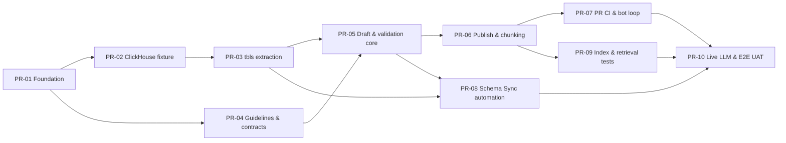

# Pull Request Plan — ClickHouse Metadata Review Loop

**Nguồn yêu cầu:** [PRD.md](./PRD.md)
**Mục tiêu:** triển khai MVP theo các PR nhỏ, độc lập, dễ review và có thể rollback
**Số PR dự kiến:** 10
**Critical path:** PR-01 → PR-02 → PR-03 → PR-05 → PR-06 → PR-07 → PR-09 → PR-10

Tài liệu này tinh chỉnh cấu trúc logic trong PRD thành package boundaries dùng khi code; nếu danh sách file giữa hai tài liệu khác nhau, kiến trúc tại mục 2 của PR plan là nguồn triển khai chi tiết.

## 1. Nguyên tắc chia PR

Mỗi PR phải:

- Giải quyết một concern chính và có acceptance criteria kiểm chứng được.
- Có test cùng PR; không để “sẽ bổ sung test sau”.
- Giữ dưới khoảng 500 dòng code reviewable nếu có thể; generated docs, lockfile và fixture không tính vào giới hạn này.
- Không refactor ngoài phạm vi nếu không cần cho acceptance criteria.
- Không đưa secret, credential thật hoặc row data thật vào repository.
- Có hướng dẫn chạy local và ghi rõ command đã dùng để verify.
- Có thể merge độc lập mà không làm hỏng `main`.
- Ưu tiên deterministic behavior trước khi tích hợp live LLM hoặc external index.

Quy ước:

```text
Branch:  feat/pr-01-repository-foundation
Title:   feat(foundation): scaffold metadata pipeline repository
Commit:  feat(scope): concise description
```

## 2. Kiến trúc code để dễ maintenance

Không đặt business logic trực tiếp trong `scripts/*.py`. Script và CLI chỉ parse argument, gọi application service và chuyển exit code.

```text
src/metadata_pipeline/
├── domain/
│   ├── models.py             # ReviewDocument, PublishedDocument, Chunk
│   ├── enums.py              # DocumentStatus, ChunkType, EvidenceStatus
│   ├── errors.py             # Domain errors có message rõ ràng
│   └── hashing.py            # Schema/content hash deterministic
├── application/
│   ├── create_drafts.py      # Use case tạo review draft
│   ├── publish_metadata.py   # Use case schema + review → published
│   ├── build_chunks.py       # Use case published → semantic chunks
│   └── index_changes.py      # Use case Git diff → index actions
├── ports/
│   ├── llm.py                # Protocol/interface cho generator
│   ├── schema_source.py      # Protocol đọc tbls schema.json
│   └── index_store.py        # Protocol cho manifest/vector store
├── adapters/
│   ├── schema/tbls_json.py
│   ├── llm/mock.py
│   ├── llm/live.py
│   └── index/manifest.py
├── validation/
│   ├── review.py
│   ├── published.py
│   └── chunks.py
├── io/
│   ├── frontmatter.py
│   └── markdown.py
└── cli.py

scripts/
├── wait_for_clickhouse.sh
├── extract_schema.sh
└── metadata                 # Wrapper gọi python -m metadata_pipeline.cli
```

Quy tắc dependency:

```text
domain ← application ← adapters/CLI
  ↑           ↑
validation   ports
```

- `domain` không import GitHub, Docker, ClickHouse client hoặc SDK của LLM.
- `application` chỉ phụ thuộc `domain` và `ports`.
- `adapters` triển khai `ports`; có thể thay mock bằng live provider mà không đổi use case.
- File I/O và Markdown parsing nằm ở `io`, không trộn với rule nghiệp vụ.
- Config, prompt và guideline đều có version; không hard-code version rải rác.

## 3. Dependency map



Có thể làm song song:

- PR-02 và PR-04 sau khi PR-01 merge.
- PR-07 và PR-09 sau khi PR-06 merge.
- Chuẩn bị GitHub App/branch protection có thể chạy song song nhưng chỉ áp dụng sau khi workflow tương ứng đã merge.

### Delivery waves đề xuất

| Wave | Hạng mục | Cách thực hiện |
|---|---|---|
| 1 | PR-01 | Merge foundation trước mọi feature |
| 2 | PR-02, PR-04 | Hai người có thể làm song song |
| 3 | PR-03 | Tích hợp ClickHouse fixture với `tbls` |
| 4 | PR-05 | Chốt deterministic metadata core |
| 5 | PR-06, PR-08 | Có thể song song sau PR-05; PR-06 là nhánh critical |
| 6 | PR-07, PR-09 | Có thể song song sau PR-06 |
| 7 | PR-10 | E2E/live integration sau khi các nhánh hội tụ |

Ước tính thực tế: 5–7 ngày kỹ thuật nếu một người triển khai tuần tự, chưa tính thời gian chờ review. Mốc 3–5 ngày trong PRD khả thi khi PR-02/PR-04, PR-06/PR-08 và PR-07/PR-09 được chia cho hai người làm song song.

## 4. PR-01 — Repository foundation và quality gates

**Branch:** `feat/pr-01-repository-foundation`
**Title:** `feat(foundation): scaffold metadata pipeline repository`

### Mục tiêu

Tạo skeleton sạch, thống nhất command và quality gate trước khi thêm business logic.

### Tasks

- [ ] Tạo directory theo kiến trúc ở mục 2.
- [ ] Tạo `pyproject.toml` với Python version được pin.
- [ ] Cấu hình `pytest`, `ruff` và `mypy`.
- [ ] Tạo package `metadata_pipeline` và CLI placeholder.
- [ ] Tạo `Makefile` với các target ổn định:
  - `make install`
  - `make lint`
  - `make typecheck`
  - `make test`
  - `make verify`
- [ ] Tạo `.gitignore`, `.editorconfig` và `.env.example` không chứa secret.
- [ ] Tạo `.github/pull_request_template.md` với test evidence, risk và rollback.
- [ ] Tạo CI baseline chạy lint, typecheck và unit tests.
- [ ] Viết `README.md` phần prerequisites và development commands.
- [ ] Thêm một smoke test để chứng minh package/CLI được cài và import được.

### Files chính

```text
pyproject.toml
Makefile
README.md
.env.example
.github/pull_request_template.md
.github/workflows/quality.yml
src/metadata_pipeline/**
tests/unit/test_cli.py
```

### Acceptance criteria

- `make verify` pass trên máy sạch sau khi install dependency.
- GitHub Actions baseline pass.
- Không có business logic hoặc provider SDK trong PR này.
- README có một đường chạy duy nhất, không có command trùng chức năng.

### Không thuộc PR

- Docker, ClickHouse, `tbls`, metadata model và LLM.

## 5. PR-02 — ClickHouse Docker fixture và fake data

**Depends on:** PR-01
**Branch:** `feat/pr-02-clickhouse-fixture`
**Title:** `feat(database): add reproducible ClickHouse demo fixture`

### Mục tiêu

Dựng database demo deterministic với ba table và dữ liệu giả theo PRD.

### Tasks

- [ ] Tạo `docker-compose.yml`, pin ClickHouse version/digest đã test.
- [ ] Tạo `db/init/001_schema.sql` với:
  - `customers`
  - `orders`
  - `order_items`
  - Table và column comments đầy đủ.
- [ ] Tạo `db/init/002_seed.sql` với tối thiểu 5/8/12 records.
- [ ] Dùng UUID và timestamp cố định để test repeatable.
- [ ] Thêm healthcheck và `scripts/wait_for_clickhouse.sh`.
- [ ] Thêm target:
  - `make db-up`
  - `make db-wait`
  - `make db-check`
  - `make db-reset`
  - `make db-down`
- [ ] Viết integration test kiểm tra table count, row count và comments.
- [ ] Viết tài liệu reset volume và troubleshooting port conflict.

### Acceptance criteria

- `make db-reset db-up db-check` pass trong tối đa 90 giây.
- Có đúng ba table ban đầu và đủ row count.
- Chạy lại từ volume sạch cho cùng schema và business fixture.
- Không có PII thật; email dùng domain `.test`.
- SQL init chạy idempotent trong lifecycle được tài liệu hóa.

### Review focus

- DDL/comment có rõ grain và technical meaning không.
- Seed có đủ edge case: paid, shipped, cancelled và nhiều line items.

### Rollback

`docker compose down -v`; revert PR không ảnh hưởng external database.

## 6. PR-03 — `tbls` extraction và raw schema contract

**Depends on:** PR-02
**Branch:** `feat/pr-03-tbls-schema-extraction`
**Title:** `feat(schema): generate raw ClickHouse documentation with tbls`

### Mục tiêu

Đọc ClickHouse bằng `tbls`, sinh raw docs/`schema.json` và định nghĩa contract cho schema source.

### Tasks

- [ ] Thêm `tbls` tool service vào Docker Compose hoặc setup script được pin version.
- [ ] Tạo `.tbls.yml` với DSN qua environment variable.
- [ ] Khai báo hai virtual relations:
  - `orders.customer_id → customers.customer_id`
  - `order_items.order_id → orders.order_id`
- [ ] Bật table/column comment lint.
- [ ] Tạo `scripts/extract_schema.sh` fail-fast và không log credential.
- [ ] Thêm target `make schema-doc`, `make schema-lint`, `make schema-diff`.
- [ ] Implement `TblsSchemaSource` đọc `schema.json` thành domain-neutral DTO.
- [ ] Tạo contract test với fixture `schema.json` nhỏ, không phụ thuộc live DB.
- [ ] Tạo integration test chạy ClickHouse → `tbls` → schema assertions.
- [ ] Document raw directory là generated-only.

### Files chính

```text
.tbls.yml
docker-compose.yml
scripts/extract_schema.sh
schema/raw/commerce_demo/**
src/metadata_pipeline/ports/schema_source.py
src/metadata_pipeline/adapters/schema/tbls_json.py
tests/contract/test_tbls_schema_source.py
tests/integration/test_tbls_extraction.py
```

### Acceptance criteria

- `make schema-doc schema-lint` pass.
- Raw output có Markdown, ER diagram và `schema.json`.
- Parser đọc được table, column, type, comment và relations.
- Parser báo lỗi có path/field khi schema JSON không hợp lệ.
- `schema/raw/**` không chứa password hoặc DSN có credential.

### Không thuộc PR

- Review metadata, LLM, published docs và GitHub bot.

## 7. PR-04 — Hai guideline và metadata contracts

**Depends on:** PR-01; có thể song song PR-02/03
**Branch:** `agent/reviewer-metadata-contract`
**Title:** `feat(metadata): validate reviewer metadata contract`

### Mục tiêu

Biến Guideline 1 và Guideline 2 trong PRD thành contract có version, ví dụ cụ thể và testable schema.

### Tasks

- [ ] Viết `guidelines/reviewer_metadata_guideline.md`:
  - Required/conditional/recommended fields.
  - Purpose, grain, owner, use/not-use, columns, rules, joins.
  - Time, unit, freshness, quality, security, aliases và evidence.
  - Checklist trước `approved`.
- [ ] Viết `guidelines/llm_transformation_guideline.md`:
  - Source precedence.
  - Conflict behavior.
  - Output front matter và section order.
  - Claim/evidence rules.
  - Chunking/retrieval contract.
- [ ] Tạo strict Pydantic model và export JSON Schema deterministic.
- [ ] Tạo ba YAML template cho `customers`, `orders`, và `order_items`.
- [ ] Validate table, column và relationship endpoint với raw `schema.json`.
- [ ] Thêm `make review-check` và GitHub Actions required gate.
- [ ] Tạo `docs/examples/published_orders.md` để minh họa output, tránh bị index nhầm như published document thật.
- [ ] Tạo `config/metadata_contract.yml` làm single source cho:
  - Guideline versions.
  - Required headings.
  - Allowed statuses/chunk types.
  - Token thresholds.
- [ ] Link Guideline 1 trong PR template.
- [ ] Thêm CODEOWNERS cho hai guideline.
- [ ] Review wording với ít nhất một domain reviewer và một AI/Data engineer.

### Acceptance criteria

- Reviewer có thể hoàn thiện template mà không cần đọc prompt LLM.
- Reviewer không thể khai báo table/column không tồn tại trong raw `schema.json`.
- JSON Schema sinh lại deterministic và CI phát hiện generated schema chưa commit.
- Guideline 2 xác định rõ behavior khi schema/review mâu thuẫn.
- Version chỉ được khai báo một lần trong config; code về sau chỉ đọc config.
- Ví dụ không chứa claim trái với fake schema.
- Hai guideline có owner và change policy.

### Change policy

- Patch wording không đổi behavior: tăng patch version nếu áp dụng semantic versioning.
- Đổi required field/output/chunk rule: tăng minor/major version và yêu cầu regenerate.
- PR đổi Guideline 2 phải ghi impact tới published docs và golden tests.

## 8. PR-05 — Deterministic draft generation và strict review validation

**Depends on:** PR-03, PR-04
**Branch:** `feat/pr-05-metadata-validation-core`
**Title:** `feat(metadata): add deterministic review draft generation`

### Mục tiêu

Mở rộng contract đã có từ PR-04 bằng use case deterministic để tạo/refresh reviewer YAML từ raw
`schema.json`, giữ nguyên nội dung con người đã review và siết validation khi tài liệu chuyển sang
`approved`. PR này không tạo lại domain models, schema hash hoặc table/column reference validation
đã hoàn thành trong PR-04.

### Tasks

- [ ] Implement deterministic YAML writer:
  - Stable field ordering và UTF-8/newline thống nhất.
  - Atomic write để không để lại file dở dang.
  - Serialize rồi parse lại phải giữ đúng Pydantic contract.
- [ ] Bổ sung test canonical schema hash:
  - JSON key order/column order/relation order không làm đổi hash.
  - Type, comment hoặc relation thay đổi phải làm đổi hash.
- [ ] Implement `CreateDrafts` use case:
  - Tạo YAML draft cho table mới với `owner/reviewer: unassigned` và `needs_review`.
  - Không ghi file khi schema không đổi; chạy hai lần không tạo diff.
  - Không ghi đè purpose, grain, evidence hoặc nội dung reviewer hiện có.
  - Column mới được thêm dưới dạng draft `proposed`.
  - Schema đổi thì cập nhật hash và hạ status về `needs_review`.
  - Column/table bị xóa không bị xóa metadata âm thầm; trả issue yêu cầu reviewer xử lý.
- [ ] Mở rộng `ValidationIssue` với `severity` (`error`/`warning`).
- [ ] Mở rộng review validator:
  - Timestamp được `approved` phải có time semantics/timezone.
  - Measure được `approved` phải có unit.
  - Status/categorical được `approved` phải có allowed values hoặc caveat.
  - PII-like semantic type phải có sensitivity classification phù hợp.
  - Evidence `conflicting` luôn chặn approval; approved claim phải có evidence.
  - Guideline version, schema hash và technical references tiếp tục được kiểm tra.
- [ ] CLI commands:
  - `metadata draft`
  - mở rộng `metadata validate-review` để exit `1` khi có error và `0` khi chỉ có warning.
- [ ] Make targets:
  - `make review-draft`
  - giữ `make review-validate` và `make review-check` làm validation gates.
- [ ] Unit/contract tests cho happy path, idempotency, preserve-content và từng validation error.
- [ ] Golden tests cho deterministic draft của `customers`, `orders`, `order_items`.

### Clean-code constraints

- Validator trả `list[ValidationIssue]`, không `print` trực tiếp.
- Mỗi issue có `code`, `path`, `field`, `message`, `severity`.
- CLI là nơi duy nhất format issue cho console/GitHub annotations.
- Draft generator không xóa hoặc nâng trạng thái reviewer content âm thầm.
- Không gọi LLM trong PR này.

### Acceptance criteria

- `metadata draft` tạo YAML hợp lệ cho table mới; chạy lần hai không tạo diff.
- Nội dung reviewer không bị ghi đè khi thêm column hoặc đổi technical schema.
- Schema đổi cập nhật hash, hạ `approved` về `needs_review` và thêm draft cho column mới.
- Column/table bị xóa tạo actionable issue thay vì làm mất metadata.
- Column giả, stale hash, approved thiếu evidence/unit/time semantics đều fail đúng error code.
- Unit test coverage của domain/application/validation đạt ít nhất 85%.
- `make verify` và integration test với real `schema.json` pass.

### Không thuộc PR

- Published document, mock/live LLM generator, semantic chunking, retrieval/index và bot commit.

## 9. PR-06 — Published transformation, semantic chunking và mock generator

**Depends on:** PR-05
**Branch:** `feat/pr-06-publish-and-chunk`
**Title:** `feat(knowledge): generate retrieval-ready metadata and semantic chunks`

### Mục tiêu

Chuyển schema + review metadata thành published docs và chunks deterministic trước khi thêm live LLM.

### Tasks

- [ ] Định nghĩa `LLMGenerator` port với structured request/response.
- [ ] Implement `MockGenerator` deterministic theo Guideline 2.
- [ ] Implement `PublishMetadata` use case với source precedence và conflict detection.
- [ ] Implement `PublishedDocument` và `Chunk` models.
- [ ] Render front matter/section đúng output contract.
- [ ] Implement semantic chunker theo heading/block:
  - `overview`
  - `columns`
  - `business_rules`
  - `relationships`
  - `time_semantics`
  - `caveats`
  - `examples`
- [ ] Implement stable chunk ID và parent-child reference.
- [ ] Implement published/chunk validators:
  - Không heading rỗng.
  - Không table/column lạ.
  - Join context đầy đủ.
  - Measure không mất unit/filter/time context.
  - Token hard limit cấu hình được.
- [ ] CLI commands:
  - `metadata publish --mode mock`
  - `metadata chunk --dry-run`
  - `metadata validate-published`
- [ ] Golden snapshot cho `orders` published document và chunks.
- [ ] Test idempotency: cùng input/version sinh byte-identical output.

### Acceptance criteria

- `orders` sinh đủ required sections và traceability.
- Mỗi chunk có metadata bắt buộc, stable ID và self-contained context.
- Relation chunk chứa đủ hai table, join condition, cardinality và duplicate risk.
- Chạy publish/chunk hai lần không tạo diff.
- Mock mode không cần network hoặc secret.

### Không thuộc PR

- Live LLM API, bot push, vector database.

## 10. PR-07 — Pull Request CI, bot commit và loop prevention

**Depends on:** PR-06
**Branch:** `feat/pr-07-metadata-pr-workflow`
**Title:** `feat(ci): automate metadata regeneration on pull requests`

### Mục tiêu

Triển khai human commit → bot commit → validate latest SHA mà không tạo loop.

### Tasks

- [ ] Tạo `.github/workflows/metadata-pr.yml`, trigger mọi PR vào `main`.
- [ ] Checkout đúng PR head SHA với full diff context cần thiết.
- [ ] Implement changed-path detector có unit test.
- [ ] Define input paths:
  - `schema/raw/**`
  - `metadata/review/**`
  - `prompts/**`
  - `guidelines/**`
  - `config/metadata_contract.yml`
- [ ] Define bot output allowlist: `knowledge/published/**`.
- [ ] Chạy validate review → publish → validate published → chunk dry-run.
- [ ] Commit published output bằng bot token nếu có diff.
- [ ] Lượt bot-only chỉ validate; không generate lần hai.
- [ ] Fail nếu human sửa trực tiếp published files.
- [ ] Thêm same-repository guard; không expose secret cho fork.
- [ ] Thêm concurrency theo PR number.
- [ ] Luôn trả required check `Metadata PR / pr-gate`.
- [ ] Ghi Job Summary: changed paths, actions, validation counts và bot commit SHA.
- [ ] Viết test script mô phỏng path matrix và loop guard.

### Security tasks

- [ ] Ưu tiên GitHub App installation token; MVP có thể dùng fine-grained PAT có expiry/owner.
- [ ] Permissions mặc định read-only.
- [ ] Không dùng `pull_request_target` để checkout/execute code PR.
- [ ] Không log token hoặc remote URL chứa token.

### Acceptance criteria

- Human sửa review tạo tối đa một bot commit.
- Bot commit kích hoạt lượt CI mới và latest SHA pass required check.
- Human sửa published trực tiếp bị fail với error rõ ràng.
- PR không liên quan metadata vẫn có `pr-gate` hoàn tất, không pending.
- Fork PR không thể truy cập bot/LLM secret.

### Rollout

1. Merge workflow nhưng chưa đặt required.
2. Chạy test PR happy path và failure path.
3. Xác nhận tên check ổn định.
4. Bật required check trong branch protection cho `main`.

## 11. PR-08 — Scheduled/manual Schema Sync tạo PR

**Depends on:** PR-03, PR-05
**Branch:** `feat/pr-08-schema-sync-workflow`
**Title:** `feat(ci): automate ClickHouse schema sync pull requests`

### Mục tiêu

Tự động chạy `tbls`, tạo/update drafts và mở draft PR mà không push thẳng `main`.

### Tasks

- [ ] Tạo `.github/workflows/schema-sync.yml` với `workflow_dispatch`.
- [ ] Thêm schedule sau UAT; trước đó gate bằng repository variable.
- [ ] Trong MVP, dựng ClickHouse fixture trong runner.
- [ ] Chạy `tbls doc --rm-dist`, `tbls lint`, draft và validation.
- [ ] Nếu không có diff: kết thúc success, không tạo empty PR.
- [ ] Nếu có diff: tạo branch timestamped, commit và draft PR.
- [ ] PR body liệt kê table added/modified/deleted và review files cần xác nhận.
- [ ] Dùng concurrency group cho schema sync.
- [ ] Cleanup Docker ở bước `always()`.
- [ ] Test schema-change scenario: thêm `order_events` và `orders.channel` bằng fixture riêng.

### Acceptance criteria

- Manual dispatch tạo đúng một draft PR khi có schema diff.
- Không có diff thì không tạo branch/PR rác.
- Existing reviewer content được giữ; affected document hạ về `needs_review`.
- Workflow chỉ commit `schema/raw/**` và `metadata/review/**`.
- PR body đủ thông tin để reviewer biết table nào cần xử lý.

### Production follow-up, không làm trong MVP

- Self-hosted runner, database allowlist và read-only production account.

## 12. PR-09 — Index manifest và golden retrieval smoke tests

**Depends on:** PR-06; có thể song song PR-07
**Branch:** `feat/pr-09-index-manifest`
**Title:** `feat(index): build versioned chunk manifest after merge`

### Mục tiêu

Kiểm chứng post-merge index lifecycle mà chưa cần vector database.

### Tasks

- [ ] Implement `IndexStore` port.
- [ ] Implement `ManifestIndexStore` adapter.
- [ ] Implement Git diff mapper A/M/D/R → index actions.
- [ ] Chỉ nhận published document `approved`.
- [ ] Xóa chunk version cũ trước upsert khi schema hash/review commit đổi.
- [ ] Tạo manifest chứa document/chunk metadata và source versions.
- [ ] Tạo `tests/fixtures/golden_questions.yml` tối thiểu 10 câu.
- [ ] Implement deterministic lexical/mock retriever cho CI smoke test.
- [ ] Verify top-3 document rate ≥ 90% và `required_facts` có trong chunk.
- [ ] Tạo `.github/workflows/index.yml` chạy sau push vào `main` khi published thay đổi.
- [ ] Upload index manifest và retrieval report làm artifacts.
- [ ] Test delete, rename, modified và unapproved scenarios.

### Acceptance criteria

- PR chưa merge không chạy index workflow.
- Manifest có stable chunk ID, schema hash, review commit và guideline version.
- Unapproved document không xuất hiện trong manifest.
- Golden test fail nếu đúng document nhưng chunk thiếu required fact.
- A/M/D/R tạo đúng action list và không còn stale chunks.

### Không thuộc PR

- Embedding API, Qdrant/pgvector, production promotion/rollback.

## 13. PR-10 — Live LLM adapter, full E2E và hardening

**Depends on:** PR-07, PR-08, PR-09
**Branch:** `feat/pr-10-live-llm-e2e`
**Title:** `feat(ai): add live metadata generation and end-to-end UAT`

### Mục tiêu

Thêm live provider sau khi toàn bộ deterministic path ổn định, chạy một PR thật qua đủ workflow và chốt vận hành.

### Tasks

- [ ] Implement `LiveLLMGenerator` sau `LLMGenerator` port.
- [ ] Dùng structured output/schema validation nếu provider hỗ trợ.
- [ ] Tách provider configuration khỏi prompt/guideline version.
- [ ] Thêm timeout, retry có giới hạn và actionable errors.
- [ ] Không retry validation/business conflict lỗi.
- [ ] Redact secret và PII khỏi logs/request fixtures.
- [ ] Lưu model identifier, prompt version và guideline versions trong traceability.
- [ ] Thêm `--mode live` chỉ qua manual/UAT gate ban đầu.
- [ ] Chạy ba scenario trong PRD:
  - Happy path.
  - Schema change.
  - Invalid column/guardrail.
- [ ] Chạy human commit → bot commit → re-approval → merge → index artifact.
- [ ] Ghi UAT evidence trong `docs/uat/metadata-mvp.md`.
- [ ] Hoàn thiện runbook:
  - Bot token rotation.
  - Failed generation recovery.
  - Stuck PR check.
  - Re-index.
  - Guideline version upgrade.
- [ ] Cập nhật README onboarding từ máy sạch.

### Acceptance criteria

- Live output pass cùng validator/chunker với mock output; không có nhánh validation riêng.
- Không có unverified inference trong document `approved`.
- Một PR thật hoàn thành đủ chuỗi và lưu evidence.
- Golden retrieval threshold vẫn đạt sau live generation.
- Failure không tạo partial bot commit hoặc partial index.
- Runbook được một maintainer khác dry-run thành công.

### Rollback

- Chuyển repository variable về `GENERATOR_MODE=mock`.
- Revert bot commit nếu chưa merge.
- Nếu đã merge, tạo corrective PR; không rewrite `main`.

## 14. Required checks theo từng giai đoạn

| Sau PR | Required checks đề xuất |
|---|---|
| PR-01 | `Quality / lint`, `Quality / typecheck`, `Quality / unit-tests` |
| PR-03 | Thêm `Integration / tbls-contract` nếu runtime ổn định |
| PR-05 | Thêm `Metadata / validate-review` |
| PR-06 | Thêm `Metadata / publish-contract` |
| PR-07 | Chuyển sang required check tổng `Metadata PR / pr-gate` |
| PR-09 | Index workflow không chặn PR; retrieval smoke chạy trong `pr-gate` với fixture |

Không bật required check trước khi đã có ít nhất một test PR xác nhận tên check và trigger ổn định.

## 15. Test strategy tổng thể

```text
tests/
├── unit/           # Domain rules, hashing, validation, diff mapping
├── contract/       # tbls schema, LLM structured response, manifest schema
├── integration/    # ClickHouse + tbls; filesystem publish/chunk/index
├── e2e/            # Workflow scenario scripts
├── fixtures/       # schema.json, review docs, golden questions
└── snapshots/      # Published Markdown và chunks deterministic
```

Quy tắc:

- Unit test không cần Docker/network.
- Contract test không gọi live LLM.
- Integration test Docker được đánh marker và chạy ở CI job riêng.
- Live LLM test chỉ manual/UAT; không chạy trên mọi PR.
- Snapshot chỉ dùng cho output contract lớn; assertion nghiệp vụ vẫn phải explicit.
- Mỗi bug production/UAT phải có regression test trước hoặc cùng fix PR.

## 16. Review ownership

| Hạng mục | Reviewer chính | Reviewer phụ |
|---|---|---|
| PR-01 | Platform/Python maintainer | Data engineer |
| PR-02 | ClickHouse/Data engineer | Analytics engineer |
| PR-03 | Data engineer | Platform engineer |
| PR-04 | Domain reviewer/Data steward | AI engineer |
| PR-05 | Python/Metadata engineer | Domain reviewer |
| PR-06 | AI/Retrieval engineer | Metadata engineer |
| PR-07 | Platform/Security engineer | Metadata engineer |
| PR-08 | Data engineer | Platform engineer |
| PR-09 | Retrieval engineer | Data/AI engineer |
| PR-10 | AI engineer | Platform + Domain reviewer |

## 17. PR description template

Mỗi PR dùng cấu trúc:

```markdown
## Outcome
Một câu mô tả trạng thái đạt được sau khi merge.

## Scope
- Những gì PR thay đổi.

## Explicitly out of scope
- Những gì cố ý để PR sau.

## Design decisions
- Quyết định và trade-off quan trọng.

## Verification
- [ ] make lint
- [ ] make typecheck
- [ ] make test
- [ ] command/integration scenario riêng của PR

## Test evidence
Log ngắn, screenshot hoặc link workflow run.

## Risk and rollback
Rủi ro chính và cách revert/disable an toàn.

## Follow-up
PR hoặc issue tiếp theo, không dùng TODO mơ hồ.
```

## 18. Definition of Done cho toàn bộ PR plan

- PR-01 đến PR-10 đã merge theo dependency hoặc có decision record giải thích PR bị loại.
- `main` luôn xanh và protected trong suốt rollout.
- Local flow chạy được bằng documented Make targets.
- Mock flow deterministic; live flow dùng cùng contract/validator.
- Hai guideline có version, CODEOWNERS và change policy.
- Human feedback tạo tối đa một bot commit; latest SHA có required check.
- Chỉ approved documents được chunk/index.
- Golden retrieval top-3 ≥ 90% và required facts pass.
- Có UAT evidence cho happy path, schema change và guardrail.
- Maintainer khác có thể vận hành theo README/runbook mà không cần tác giả hỗ trợ trực tiếp.
