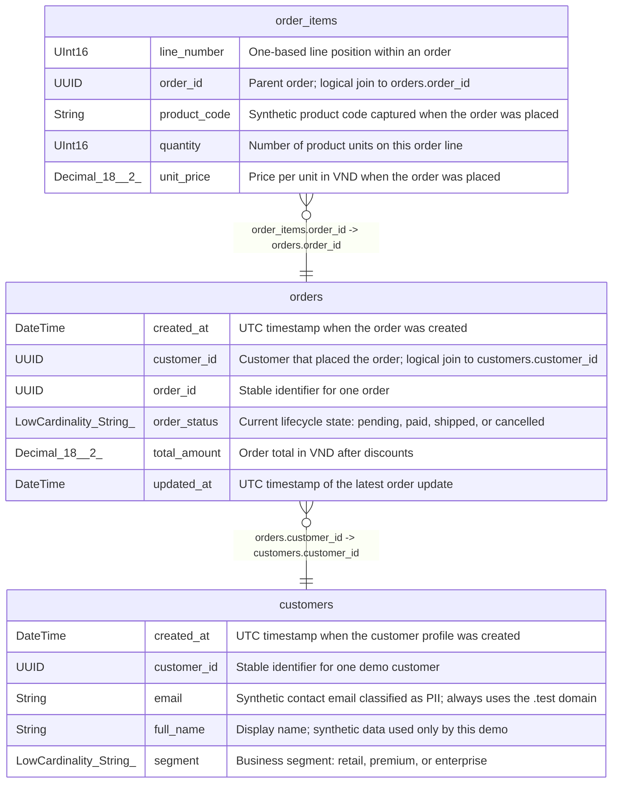

# commerce_demo

## Description

Deterministic ClickHouse schema for the metadata review demo

## Tables

| Name | Columns | Comment | Type |
| ---- | ------- | ------- | ---- |
| [customers](customers.md) | 5 | Customer dimension at one row per customer; contains synthetic PII-like fields. | MergeTree |
| [order_items](order_items.md) | 5 | Order detail fact at one row per order_id and line_number. | MergeTree |
| [orders](orders.md) | 6 | Order fact at one row per order_id; cancelled orders remain in the table. | MergeTree |

## Relations

---

> Generated by [tbls](https://github.com/k1LoW/tbls)
