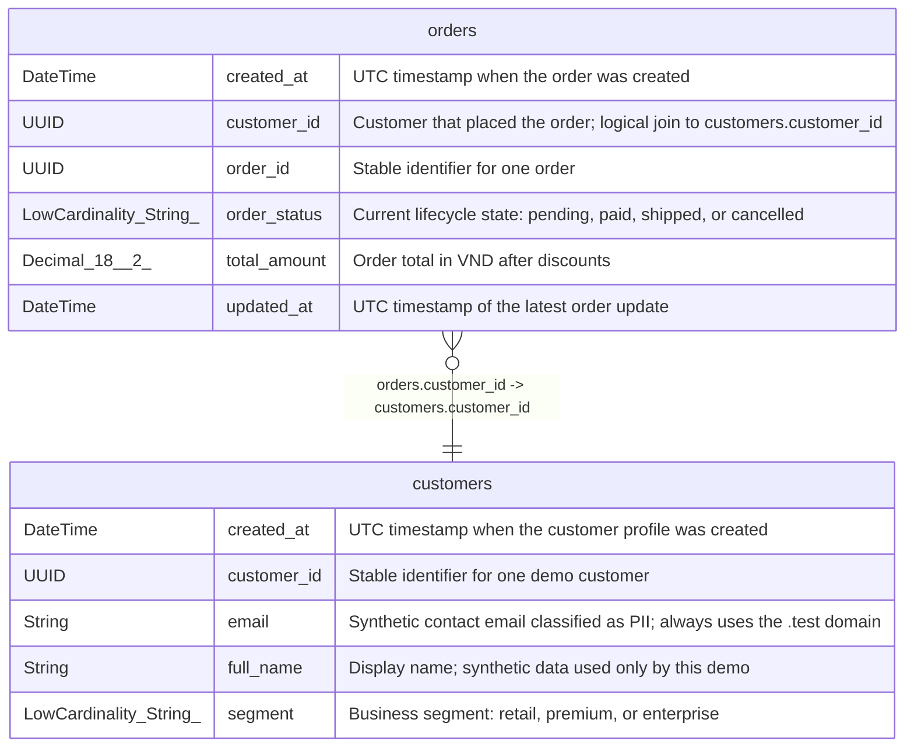

# customers

## Description

Customer dimension at one row per customer; contains synthetic PII-like fields.

<details>
<summary><strong>Table Definition</strong></summary>

```sql
CREATE TABLE commerce_demo.customers (`customer_id` UUID COMMENT 'Stable identifier for one demo customer', `full_name` String COMMENT 'Display name; synthetic data used only by this demo', `email` String COMMENT 'Synthetic contact email classified as PII; always uses the .test domain', `segment` LowCardinality(String) COMMENT 'Business segment: retail, premium, or enterprise', `created_at` DateTime COMMENT 'UTC timestamp when the customer profile was created') ENGINE = MergeTree ORDER BY customer_id SETTINGS index_granularity = 8192 COMMENT 'Customer dimension at one row per customer; contains synthetic PII-like fields.'
```

</details>

## Columns

| Name | Type | Default | Nullable | Children | Parents | Comment |
| ---- | ---- | ------- | -------- | -------- | ------- | ------- |
| created_at | DateTime |  | false |  |  | UTC timestamp when the customer profile was created |
| customer_id | UUID |  | false | [orders](orders.md) |  | Stable identifier for one demo customer |
| email | String |  | false |  |  | Synthetic contact email classified as PII; always uses the .test domain |
| full_name | String |  | false |  |  | Display name; synthetic data used only by this demo |
| segment | LowCardinality(String) |  | false |  |  | Business segment: retail, premium, or enterprise |

## Constraints

| Name | Type | Definition |
| ---- | ---- | ---------- |
| primary key | PRIMARY KEY | PRIMARY KEY (customer_id) |
| sorting key | SORTING KEY | ORDER BY (customer_id) |

## Relations



---

> Generated by [tbls](https://github.com/k1LoW/tbls)
