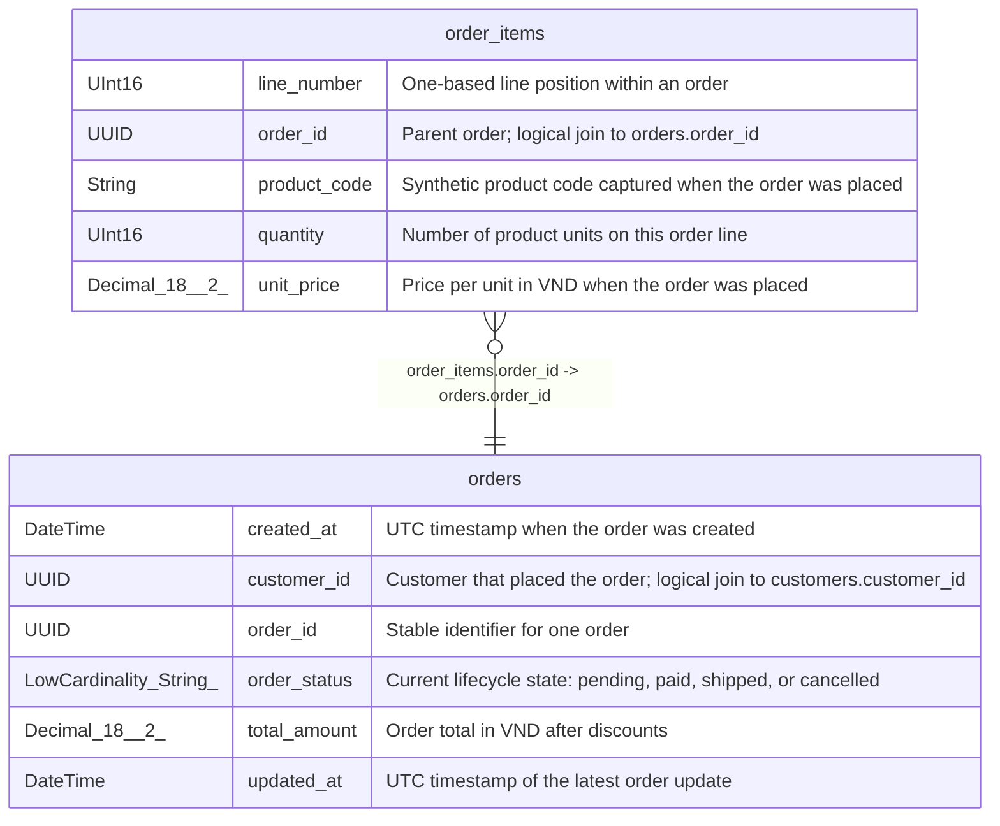

# order_items

## Description

Order detail fact at one row per order_id and line_number.

<details>
<summary><strong>Table Definition</strong></summary>

```sql
CREATE TABLE commerce_demo.order_items (`order_id` UUID COMMENT 'Parent order; logical join to orders.order_id', `line_number` UInt16 COMMENT 'One-based line position within an order', `product_code` String COMMENT 'Synthetic product code captured when the order was placed', `quantity` UInt16 COMMENT 'Number of product units on this order line', `unit_price` Decimal(18, 2) COMMENT 'Price per unit in VND when the order was placed') ENGINE = MergeTree ORDER BY (order_id, line_number) SETTINGS index_granularity = 8192 COMMENT 'Order detail fact at one row per order_id and line_number.'
```

</details>

## Columns

| Name | Type | Default | Nullable | Children | Parents | Comment |
| ---- | ---- | ------- | -------- | -------- | ------- | ------- |
| line_number | UInt16 |  | false |  |  | One-based line position within an order |
| order_id | UUID |  | false |  | [orders](orders.md) | Parent order; logical join to orders.order_id |
| product_code | String |  | false |  |  | Synthetic product code captured when the order was placed |
| quantity | UInt16 |  | false |  |  | Number of product units on this order line |
| unit_price | Decimal(18, 2) |  | false |  |  | Price per unit in VND when the order was placed |

## Constraints

| Name | Type | Definition |
| ---- | ---- | ---------- |
| primary key | PRIMARY KEY | PRIMARY KEY (order_id, line_number) |
| sorting key | SORTING KEY | ORDER BY (order_id, line_number) |

## Relations



---

> Generated by [tbls](https://github.com/k1LoW/tbls)
