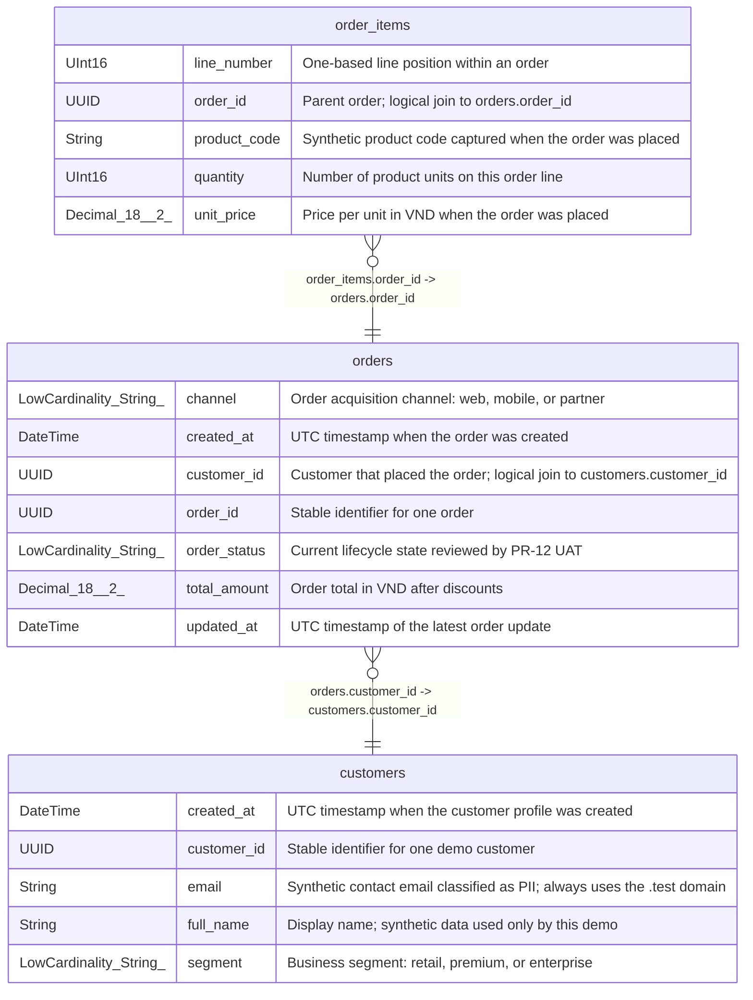

# orders

## Description

Order fact at one row per order_id; cancelled orders remain in the table.

<details>
<summary><strong>Table Definition</strong></summary>

```sql
CREATE TABLE commerce_demo.orders (`order_id` UUID COMMENT 'Stable identifier for one order', `customer_id` UUID COMMENT 'Customer that placed the order; logical join to customers.customer_id', `order_status` LowCardinality(String) COMMENT 'Current lifecycle state reviewed by PR-12 UAT', `channel` LowCardinality(String) COMMENT 'Order acquisition channel: web, mobile, or partner', `total_amount` Decimal(18, 2) COMMENT 'Order total in VND after discounts', `created_at` DateTime COMMENT 'UTC timestamp when the order was created', `updated_at` DateTime COMMENT 'UTC timestamp of the latest order update') ENGINE = MergeTree PARTITION BY toYYYYMM(created_at) ORDER BY (created_at, order_id) SETTINGS index_granularity = 8192 COMMENT 'Order fact at one row per order_id; cancelled orders remain in the table.'
```

</details>

## Columns

| Name | Type | Default | Nullable | Children | Parents | Comment |
| ---- | ---- | ------- | -------- | -------- | ------- | ------- |
| channel | LowCardinality(String) |  | false |  |  | Order acquisition channel: web, mobile, or partner |
| created_at | DateTime |  | false |  |  | UTC timestamp when the order was created |
| customer_id | UUID |  | false |  | [customers](customers.md) | Customer that placed the order; logical join to customers.customer_id |
| order_id | UUID |  | false | [order_items](order_items.md) |  | Stable identifier for one order |
| order_status | LowCardinality(String) |  | false |  |  | Current lifecycle state reviewed by PR-12 UAT |
| total_amount | Decimal(18, 2) |  | false |  |  | Order total in VND after discounts |
| updated_at | DateTime |  | false |  |  | UTC timestamp of the latest order update |

## Constraints

| Name | Type | Definition |
| ---- | ---- | ---------- |
| partition key | PARTITION KEY | PARTITION BY (toYYYYMM(created_at)) |
| primary key | PRIMARY KEY | PRIMARY KEY (created_at, order_id) |
| sorting key | SORTING KEY | ORDER BY (created_at, order_id) |

## Relations



---

> Generated by [tbls](https://github.com/k1LoW/tbls)
